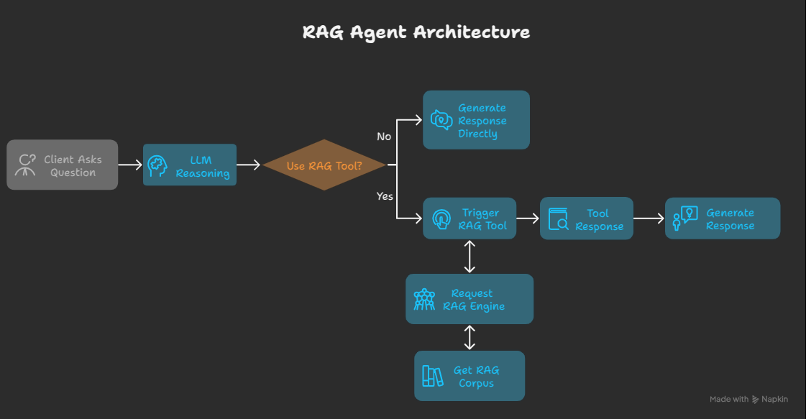

# RAG Agent with Google ADK and Qdrant MCP server

A Retrieval-Augmented Generation (RAG) system that leverages Google's Agent Development Kit (ADK) and Qdrant vector database via MCP server.

## Table of Contents
- [Overview](#overview)
- [Architecture](#architecture)
- [Features](#features)
- [Prerequisites](#prerequisites)
- [Installation](#installation)
- [Configuration](#configuration)
- [Usage](#usage)

## Overview

This project implements a Retrieval-Augmented Generation (RAG) system that combines the power of Google's Agent Development Kit (ADK) with Qdrant vector database (via MCP server) for efficient knowledge retrieval. The system enhances Large Language Model (LLM) responses by retrieving relevant context from a vector database before generating answers.

## Architecture


## Features

- **Advanced Retrieval**: Semantic search powered by Qdrant vector database
- **Google ADK Integration**: Leverages Google's Agent Development Kit for LLM capabilities
- **MCP Server**: Model Context Protocol server for Qdrant vector database
- **Context Augmentation**: Enhances LLM responses with relevant retrieved information
- **Monitoring & Logging**: Comprehensive tracking of system performance

## Installation

```bash
# Clone the repository
git clone https://github.com/khoi03/adk-mcp-rag.git
cd adk-mcp-rag

# Install uv if you don't have it already
pip install uv

# Create a virtual environment and install dependencies
uv venv .venv --python=3.12

# Activate the virtual environment
# For macOS/Linux
source .venv/bin/activate
# For Windows
.venv\Scripts\activate

# Install all required dependencies
uv pip install -r requirements.txt
```

## Configuration

### Environment Variables

Create a `.env` file in `docker` directory:

```bash
# Change directory into docker
cd docker

# Set up environment variables
cp .env.example .env
# Edit .env with your API keys and configuration
```

Example `.env` file:
```bash
# -------------------
# Google API keys
# -------------------
GOOGLE_API_KEY=YOUR_VALUE_HERE

# -------------------
# OPENAI API keys
# -------------------
OPENAI_API_KEY=YOUR_VALUE_HERE

# -------------------
# ANTHROPIC API keys
# -------------------
ANTHROPIC_API_KEY=YOUR_VALUE_HERE

# -------------------
# Network names
# -------------------
NETWORK_NAME=mcp-servers

# ----------------------------------
# Parameters for Qdrant MCP Server 
# ----------------------------------
QDRANT_CONTAINER_NAME=qdrant-mcp
QDRANT_URL=http://qdrant:6333
QRANT_MCP_SSE=http://localhost:8888/sse
# QDRANT_LOCAL_PATH=/qdrant/db
# QDRANT_API_KEY=/qdrant/db
QDRANT_PORT=8888
QDRANT_COLLECTION_NAME=demo_collection
QDRANT_EMBEDDING_MODEL=sentence-transformers/all-MiniLM-L6-v2
```

### Build Qdrant and Qdrant MCP
Build Qdrant and Qdrant MCP server using Docker Compose after completing the configuration steps:

```bash
# Build and start services
docker compose up --build -d

# Check running services
docker compose ps

# View logs
docker compose logs -f

# Stop and remove services
docker compose down
```

## Usage

### Document Ingestion
Push all your needed files into the `data` directory and run:

```bash
python local_vector_store/prepare_corpus_and_data_locally.py
```
Note: Currently only processes .md and .pdf files. The system will:

1. Extract text from the documents
2. Split the text into manageable chunks
3. Generate embeddings for each chunk
4. Store the embeddings in the Qdrant vector database

### Basic Usage
To test and run the system with default settings:

```bash
python main.py
```

### Built-in ADK-UI
For tracing, testing, and debugging with a UI, run the built-in web interface provided by ADK:

```bash
adk web
```

## Project Structure

```bash
adk-mcp-rag/
├── assets/                  # Images and static files
├── data/                    # Documents for ingestion
├── docker/                  # Docker configurations
│   ├── .env.example         # Example environment variables
│   ├── Dockerfile.qdrant    # Docker file for qdrant mcp
│   └── docker-compose.yml   # Docker Compose configuration
├── agents/                  # Main code
│   ├── config/prompts.yml   # Store prompts
│   ├── tools/               # Embedding generation
│       ├── mcp_tools.py     # Manage MCP Tools
│       └── prompts.py       # Manage Prompts
│   └── agent/               # Manage agents
├── .gitignore               # Git ignore file
├── main.py                  # Main entry point
├── README.md                # This file
└── requirements.txt         # Python dependencies
```